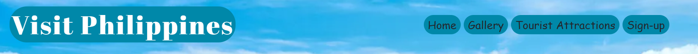
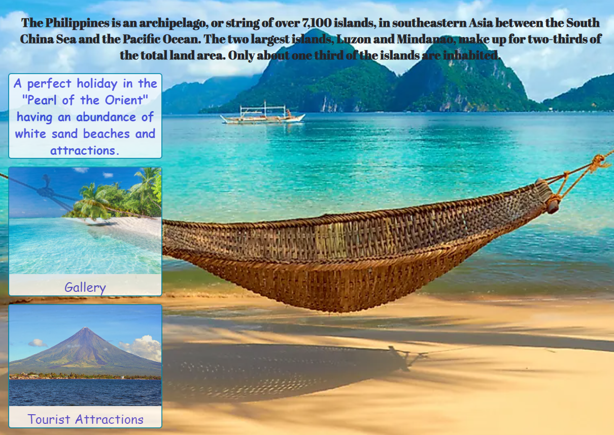
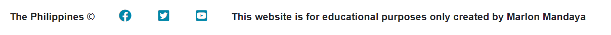

# Visit Philippines

This webiste is to attract tourist from different parts of the world  looking for a holiday in the South East Asia, particularly the Philippines that is abundant with stunning white sand beaches.
Aside from white sand beaches, Philippines has a lot of attractions for tourist to visit like the Chocolate Hills of Bohol, Underground River in Palawan, Mayon Volcano, and two best islands, Boracay and El Nido, Palawan, ranked as the best island beaches in the world.

* ## Navigation Bar

   * The navigation bar is full responsive featured in all four pages, it includes links to the logo which is the homepage, homepage,
Gallery, Tourist Attractions and Sign Up page.
   * It has a background color of rgba(0, 136, 169, 1), when hovered the logo's font transform into black or #24252A and the rest of the links transform into white or #FFFFFF.
   * This section will allow the user to navigate all pages easily without reverting back to the previous page via the 'back' button.

   

* ## The Landing Image

   * The background includes a photograph with paragraphs introducing the Philippines.
   * On the left side of the photograph, there are three containers. The first from the top is a sales pitch to attract tourist looking for a holiday in the Philippines.
   * The second container with a photograph nested on it with a label of 'gallery' are both linked to gallery.html page.
   * The third container  with a photograph nested on it with a label of 'tourist attractions' are also both linked to tourist-attractions.html page.

   

* ## The Footer

   * This section includes links to the relevant social media sites for Visit Philippines except  the twitter.
   * The Facebook and Youtube link opens to a new tab with a video content showcasing the stunning tourist attractions Philippines has to offer to the world.

   

* ## The Gallery

   * On the top of the images, there is a link that will allow the user to also open the Sign-up.html page.
   * In this section, it allows the user to see the preview of stunning images and amazing scenery of  what they can look forward to when visiting the Philippines.

   

* ## Tourist Attractions Page

   * This page allows the user to get information on the specific  name and location of the place and the details accompanied with a photograph above the paragraphs.
   * This section will allow the user to help make a decision which part of the Philippines they wanted to visit.

   

* ## The Sign-up Page

   * This page will allow the user to get signed up to get the best holiday offers and packages and newsletters offering the user for a limited time.
   * On this page, the user will be asked to submit their full name and address.

   

* ## About Us Page

   * With a deadline for submission missed, I am planning to add this page in the future to create a little history for the Visit Philippines website.

## Testing

### Validator Testing

 * HTML
   * No errors were returned when passing through the official [WRC validator](https://validator.w3.org/)
 * CSS
   * No errors were found when passing through the official [(Jigsaw) validator](https://jigsaw.w3.org/css-validator/)

## Deployment
 
 * The site was deployed to GitHub pages. The steps to deploy are as follows:
   * In the GitHub repository, navigate to the Settings tab
   * From the source section drop-down menu, select the Master Branch
   * Once the master branch has been selected, the page will be automatically refreshed with a detailed ribbon display to indicate the successful deployment.

The live link can be found here - 

## Credits

### Content

  * The icons in the footer were taken from [Font Awesome](https://fontawesome.com/)

### Media

  * The photos used on the home and sign up page are from This Open Source sites :
    * [World Atlas](https://www.worldatlas.com/articles/top-10-tourist-attractions-in-the-philippines.html)
    * [Fox News](https://static.foxnews.com/foxnews.com/content/uploads/2019/01/BoracaySandCastleiStock.jpg)

  * The photos used on the landing image containers are from this foloowing sites :
    * [PlanetWare](https://www.planetware.com/photos-large/PHI/philippines-albay-mayon-volcano.jpg)
    * 

  * The images used for the gallery page were taken from this following sites :
    * 